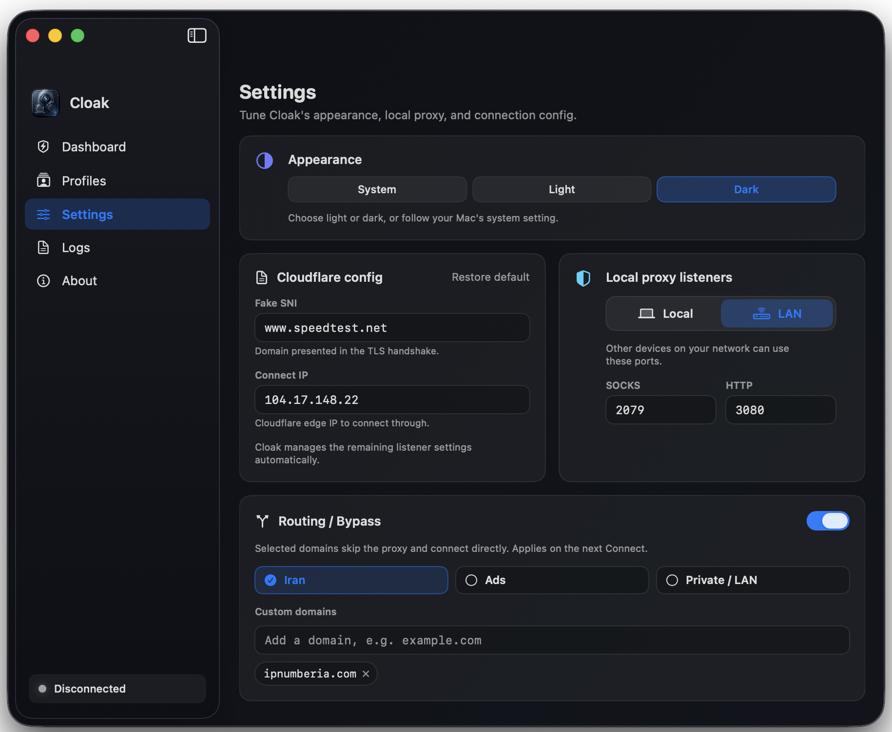

# Cloak

[فارسی](README.fa.md)

**Cloak is a simple macOS app for connecting with CDN profiles without the usual setup headache.**

Import your profiles, test them, choose the best one, and connect. Cloak prepares the connection and applies the right macOS settings for you, so you do not have to juggle scripts, terminals, or separate clients.

<table>
  <tr>
    <td align="center" width="50%">
      <strong>Dashboard</strong> 
      
    </td>
    <td align="center" width="50%">
      <strong>Profiles</strong> 
      
    </td>
  </tr>
  <tr>
    <td align="center">
      <strong>Settings</strong> 
      
    </td>
    <td align="center">
      <strong>Menu bar</strong> 
      
    </td>
  </tr>
</table>

## Why Cloak

- Connect from one clean macOS app
- Import profile links or drag in a text file
- Ping profiles before connecting
- Route all traffic with Tunnel mode
- Use system proxy mode when you only need app-level routing
- See your egress IP and session traffic
- Control everything from the menu bar
- No manual setup, no separate core install, no terminal workflow

## Download

Get the latest **DMG** from [GitHub Releases](https://github.com/g3ntrix/Cloak/releases).

After opening the DMG, drag **Cloak** to **Applications**.

Because Cloak is an open-source community build, macOS may ask you to confirm the first launch. If that happens, open **System Settings -> Privacy & Security** and choose **Open Anyway**.

## Quick Start

1. Open Cloak.
2. Approve the one-time permission.
3. Import or paste your profiles.
4. Ping them and select one that works.
5. Press **Connect**.

That is the whole idea: bring a working profile, and Cloak takes care of the rest.

## Donations

If Cloak helps you, you can support development:

- **TON:** `UQCriHkMUa6h9oN059tyC23T13OsQhGGM3hUS2S4IYRBZgvx`
- **USDT (BEP20):** `0x71F41696c60C4693305e67eE3Baa650a4E3dA796`
- **TRX (TRON):** `TFrCzU7bDey9WSh3fhqCBqhaiMzr8VhcUV`

## License

See [LICENSE](LICENSE).
