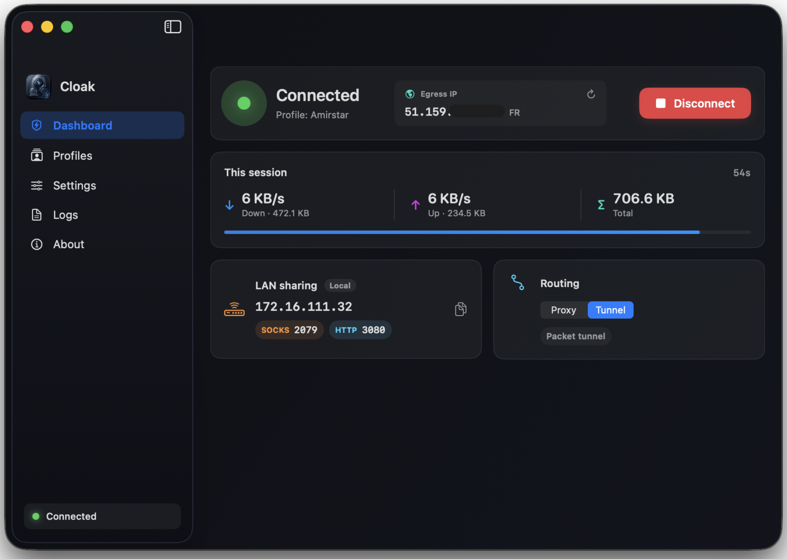
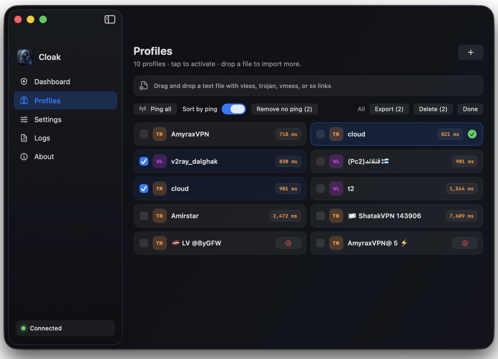
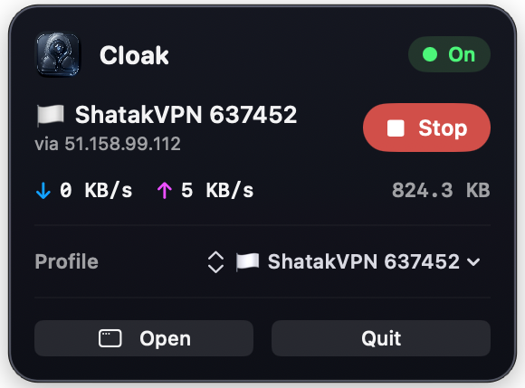
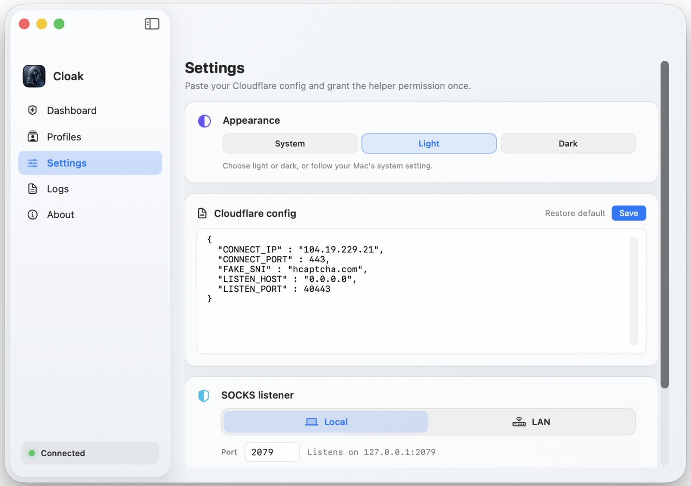

# Cloak

[فارسی (Persian)](README.fa.md)

**Cloak** is a macOS app that routes traffic through a local SNI-spoofing bridge and an embedded **Xray** core. Import CDN profiles (VLESS, Trojan, and more), connect with one click, and optionally send all system traffic through the local SOCKS proxy.

<table>
  <tr>
    <td align="center" width="50%">
      <strong>Dashboard</strong> 
      
    </td>
    <td align="center" width="50%">
      <strong>Profiles</strong> 
      
    </td>
  </tr>
  <tr>
    <td align="center">
      <strong>Menu bar</strong> 
      
    </td>
    <td align="center">
      <strong>Light mode</strong> 
      
    </td>
  </tr>
</table>

## Features

- **One-click connect** — Start/stop the Python listener and Xray from the dashboard or menu bar
- **Profile library** — Paste links or drag-and-drop a text file (`vless`, `trojan`, `vmess`, `ss`)
- **Real profile ping** — Measure latency through each profile’s tunnel; ping all with cancel; remove profiles with no ping
- **VPN Tunnel Mode (utun)** — Route 100% of your system traffic (both TCP and UDP) at the network layer through a dynamically allocated virtual interface (`utun`), avoiding "resource busy" conflicts with other VPN clients
- **System proxy toggle** — Route macOS apps through Cloak’s local SOCKS and HTTP proxy endpoints
- **Auto-DNS Management** — Automatically overrides active DNS configurations to secure public resolvers (`1.1.1.1` / `8.8.8.8`) during tunnel connection, flushing DNS caches and restoring DHCP defaults seamlessly on stop
- **LAN sharing** — Bind the listener to this Mac only or expose it on your network (Local / LAN)
- **Egress IP** — See your public IP through the active profile while connected
- **Menu bar control** — Connect, switch profiles, and open the main window without keeping it open
- **Appearance** — Follow system, or choose light / dark manually
- **Logs** — Optional capture of listener and Xray output for troubleshooting

## Download (macOS)

Get the latest **`.dmg`** from [GitHub Releases](https://github.com/g3ntrix/Cloak/releases).

> **Unsigned build:** macOS may block the app on first launch. Use **System Settings → Privacy & Security** to allow it if needed.

## Quick start

1. Open Cloak and grant the one-time helper permission (Settings).
2. Paste your Cloudflare listener JSON in **Settings** if you use the bundled SNI bridge.
3. Select a profile, then **Connect** on the Dashboard.
4. Set the connection mode to **Tunnel** for a full VPN-level system routing experience, or toggle **System proxy** to use the local SOCKS/HTTP proxy.

## Project structure

| Path | Description |
|------|-------------|
| `macos-app/` | SwiftUI macOS client (Cloak) |
| `main.py` / listener | Python SNI-spoofing bridge (bundled or dev path) |

## Support & source

- **Repository:** [github.com/g3ntrix/Cloak](https://github.com/g3ntrix/Cloak) — if Cloak helps you, a star on the repo is appreciated
- **Author:** [t.me/g3ntrix](https://t.me/g3ntrix)

## Donations

If this project helps you, you can support development:

- **TON:** `UQCriHkMUa6h9oN059tyC23T13OsQhGGM3hUS2S4IYRBZgvx`
- **USDT (BEP20):** `0x71F41696c60C4693305e67eE3Baa650a4E3dA796`
- **TRX (TRON):** `TFrCzU7bDey9WSh3fhqCBqhaiMzr8VhcUV`

## License

See [LICENSE](LICENSE).
