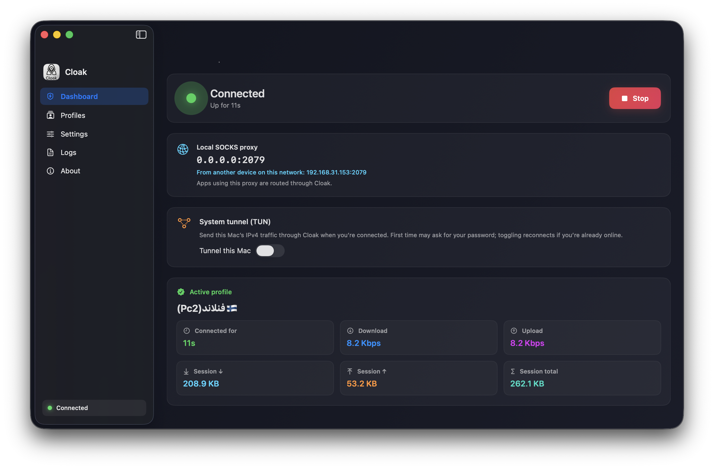

# Cloak for macOS

Cloak is an easy-to-use macOS client built around SNI spoofing. It takes CDN profile configs directly, includes the core connection logic inside the app, and removes the need to run a separate V2Ray/Xray client.

## What it does

- Import and manage profiles
- Connect/disconnect with one click
- Use local SOCKS proxy mode
- Optional system tunnel (TUN) mode
- Show direct endpoint latency so you can compare configs

## Quick start

1. Download `Cloak.app`.
2. Open the app and import your profile URL.
3. Select a profile and press **Start**.
4. Optionally enable **System tunnel (TUN)** from the Dashboard.

## Unsigned app note

This app is not code-signed. macOS may block it on first launch.  
If needed, open it via **System Settings -> Privacy & Security** and allow it manually.

## Donations

If Cloak helps you, you can support development:

- TON: `UQCriHkMUa6h9oN059tyC23T13OsQhGGM3hUS2S4IYRBZgvx`
- USDT (BEP20): `0x71F41696c60C4693305e67eE3Baa650a4E3dA796`
- TRX (TRON): `TFrCzU7bDey9WSh3fhqCBqhaiMzr8VhcUV`
